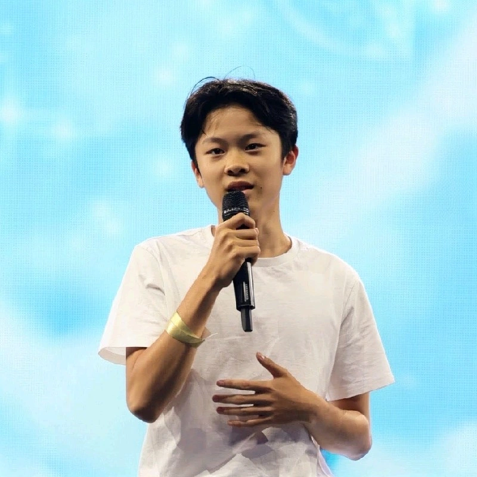

> **I help companies build AI systems that work reliably in the real world and transfer the expertise so your team can operate autonomously in the long term.**
>
> My approach is grounded in a total of 16 years in engineering, including building the AI platform team at simpleclub and shipping 5 production Gen AI systems in the last 3 years.
>
> I operate with extreme focus on the business needs and prioritize value you get over hype.
>
> My goal is to become a partner for your organization in leading you through uncertainty to reliable, production implementations with high ROI from AI and a team that is empowered and able to operate on their own.

[Get Your AI to the Next Level](https://calendar.google.com/calendar/appointments/schedules/AcZssZ0lqb2kvUx3MPxlvUIOd28Lzflc4LgzwWB9p3PHaPc3F1umAaTKDIkplzlPJcFZ9LoX2XyYjg3a?gv=true){ .md-button .md-button--primary target="_blank" }

## What I Take Off Your Plate

<ul class="feature-list">
  <li class="feature-list__item md-typeset">
    

      <svg xmlns="http://www.w3.org/2000/svg" height="24px" viewBox="0 -960 960 960" width="24px" fill="#e3e3e3"><path d="M220-520 80-600v-160l140-80 140 80v160l-140 80Zm0-92 60-34v-68l-60-34-60 34v68l60 34Zm440 123v-93l140 82v280L560-80 320-220v-280l140-82v93l-60 35v188l160 93 160-93v-188l-60-35Zm-140 89v-480h360l-80 120 80 120H600v240h-80Zm40 69ZM220-680Z"/></svg>
    

    

      <h2>The Question of Whether AI Will Actually Work in Your Context</h2>
      
I audit data readiness, technical constraints, and regulatory exposure to give you a clear Go/No-Go before you invest resources.

    

  </li>
  <li class="feature-list__item md-typeset">
    

      <svg xmlns="http://www.w3.org/2000/svg" height="24px" viewBox="0 -960 960 960" width="24px" fill="#e3e3e3"><path d="M280-720v520-520Zm170 600H280q-33 0-56.5-23.5T200-200v-520h-40v-80h200v-40h240v40h200v80h-40v172q-17-5-39.5-8.5T680-560v-160H280v520h132q6 21 16 41.5t22 38.5Zm-90-160h40q0-63 20-103.5l20-40.5v-216h-80v360Zm160-230q17-11 38.5-22t41.5-16v-92h-80v130ZM680-80q-83 0-141.5-58.5T480-280q0-83 58.5-141.5T680-480q83 0 141.5 58.5T880-280q0 83-58.5 141.5T680-80Zm66-106 28-28-74-74v-112h-40v128l86 86Z"/></svg>
    

    

      <h2>Figuring Out How to Implement Production AI on Your Own</h2>
      
I embed with your team, bringing experience from 5 production systems to guide you through implementation and transfer the knowledge needed to maintain and build similar systems in the future.

    

  </li>
  <li class="feature-list__item md-typeset">
    

      <svg xmlns="http://www.w3.org/2000/svg" height="24px" viewBox="0 -960 960 960" width="24px" fill="#e3e3e3"><path d="M200-120q-33 0-56.5-23.5T120-200v-160h80v160h160v80H200Zm560 0H600v-80h160v-160h80v160q0 33-23.5 56.5T760-120ZM120-760q0-33 23.5-56.5T200-840h160v80H200v160h-80v-160Zm720 0v160h-80v-160H600v-80h160q33 0 56.5 23.5T840-760ZM480-240q21 0 35.5-14.5T530-290q0-21-14.5-35.5T480-340q-21 0-35.5 14.5T430-290q0 21 14.5 35.5T480-240Zm-36-153h73q0-34 8-52t35-45q35-35 46.5-56.5T618-598q0-54-39-88t-99-34q-50 0-86 26t-52 74l66 27q7-26 26.5-42.5T480-652q29 0 46.5 15.5T544-595q0 20-9.5 37.5T502-521q-33 29-45.5 56T444-393Z"/></svg>
    

    

      <h2>The Guesswork of Defining What AI Talent You Need</h2>
      
I define exact roles, identify skill gaps, and create a concrete plan to build or upskill your team.

    

  </li>
  <li class="feature-list__item md-typeset">
    

      <svg xmlns="http://www.w3.org/2000/svg" height="24px" viewBox="0 -960 960 960" width="24px" fill="#e3e3e3"><path d="M40-160v-160q0-34 23.5-57t56.5-23h131q20 0 38 10t29 27q29 39 71.5 61t90.5 22q49 0 91.5-22t70.5-61q13-17 30.5-27t36.5-10h131q34 0 57 23t23 57v160H640v-91q-35 25-75.5 38T480-200q-43 0-84-13.5T320-252v92H40Zm440-160q-38 0-72-17.5T351-386q-17-25-42.5-39.5T253-440q22-37 93-58.5T480-520q63 0 134 21.5t93 58.5q-29 0-55 14.5T609-386q-22 32-56 49t-73 17ZM160-440q-50 0-85-35t-35-85q0-51 35-85.5t85-34.5q51 0 85.5 34.5T280-560q0 50-34.5 85T160-440Zm640 0q-50 0-85-35t-35-85q0-51 35-85.5t85-34.5q51 0 85.5 34.5T920-560q0 50-34.5 85T800-440ZM480-560q-50 0-85-35t-35-85q0-51 35-85.5t85-34.5q51 0 85.5 34.5T600-680q0 50-34.5 85T480-560Z"/></svg>
    

    

      <h2>Figuring Out How to Scale AI Without Breaking Things</h2>
      
I design the architecture, governance, observability and evaluation systems that enable growth across your organization without breaking existing AI systems.

    

  </li>
</ul>

## How Do I Work

<figure class="ai-loop-feature">
  <a class="ai-loop-feature__icon">
    <svg xmlns="http://www.w3.org/2000/svg" height="24px" viewBox="0 -960 960 960" width="24px" fill="#e3e3e3"><path d="m720-430 80 80v190q0 33-23.5 56.5T720-80H160q-33 0-56.5-23.5T80-160v-560q0-33 23.5-56.5T160-800h220q-8 18-12 38.5t-6 41.5H160v560h560v-270Zm52-174 128 128-56 56-128-128q-21 12-45 20t-51 8q-75 0-127.5-52.5T440-700q0-75 52.5-127.5T620-880q75 0 127.5 52.5T800-700q0 27-8 51t-20 45Zm-152 4q42 0 71-29t29-71q0-42-29-71t-71-29q-42 0-71 29t-29 71q0 42 29 71t71 29ZM160-430v270-560 280-12 22Z"/></svg>
  </a>
  <figcaption class="md-typeset">
    <h2>1. AI Use-Case & Feasibility Audit</h2>
    
<em>"We want to use AI, but need to know if it's actually feasible before committing resources."</em>

    
A short, intense diagnostic. I check your data readiness, technical constraints, regulatory exposure (EU AI Act/GDPR) and potential talent gaps. If you struggle to come up with a use case, I will help you identify the most impactful ones based on your business needs.

    
<strong>The Output:</strong> A technical "Go/No-Go" report for each use case showing if you have the data and/or talent to support your use case, how to get there, and where exactly to start.

  </figcaption>
</figure>

<figure class="ai-loop-feature">
  <a class="ai-loop-feature__icon">
    <svg xmlns="http://www.w3.org/2000/svg" height="24px" viewBox="0 -960 960 960" width="24px" fill="#e3e3e3"><path d="M760-120q-39 0-70-22.5T647-200H440q-66 0-113-47t-47-113q0-66 47-113t113-47h80q33 0 56.5-23.5T600-600q0-33-23.5-56.5T520-680H313q-13 35-43.5 57.5T200-600q-50 0-85-35t-35-85q0-50 35-85t85-35q39 0 69.5 22.5T313-760h207q66 0 113 47t47 113q0 66-47 113t-113 47h-80q-33 0-56.5 23.5T360-360q0 33 23.5 56.5T440-280h207q13-35 43.5-57.5T760-360q50 0 85 35t35 85q0 50-35 85t-85 35ZM200-680q17 0 28.5-11.5T240-720q0-17-11.5-28.5T200-760q-17 0-28.5 11.5T160-720q0 17 11.5 28.5T200-680Z"/></svg>
  </a>
  <figcaption class="md-typeset">
    <h2>2. AI Roadmap</h2>
    
<em>"We know what's possible, but we don't have the plan or the people to execute it."</em>

    
We build a pragmatic execution plan for the next 6 months. I help you address the "How do we upskill existing talent?" or "Who do we hire?" problems. You get a focused strategy ensuring your most profitable AI use cases will work with high probability in your business context.

    
<strong>The Output:</strong> Clear AI investment priorities, identified talent gaps, and concrete actions to reskill existing teams or bring in the right outside expertise.

  </figcaption>
</figure>

<figure class="ai-loop-feature">
  <a class="ai-loop-feature__icon">
    <svg xmlns="http://www.w3.org/2000/svg" height="24px" viewBox="0 -960 960 960" width="24px" fill="#e3e3e3"><path d="M200-120q-50 0-85-35t-35-85q0-50 35-85t85-35h560q50 0 85 35t35 85q0 50-35 85t-85 35H200Zm0-80h560q17 0 28.5-11.5T800-240q0-17-11.5-28.5T760-280H200q-17 0-28.5 11.5T160-240q0 17 11.5 28.5T200-200Zm200-240q-17 0-28.5-11.5T360-480v-320q0-17 11.5-28.5T400-840h320q17 0 28.5 11.5T760-800v320q0 17-11.5 28.5T720-440H400Zm40-80h240v-240H440v240Zm-360-2v-77h197v77H80Zm400-118h160v-79H480v79Zm-320 0h117v-79H160v79Zm280 120v-240 240Z"/></svg>
  </a>
  <figcaption class="md-typeset">
    <h2>3. Profitable AI Implementation</h2>
    
<em>"We are ready to build, and we want to do it right."</em>

    
I embed with your team as a Lead AI Engineer. We pick a high-value/high-impact use case and ship it. I don't build in isolation; I build with your engineers so that they absorb my knowledge and best practices and are able to act on their own in the future.

    
<strong>The Output:</strong> A reliable production AI system, but more importantly, your team builds the muscle memory to ship the next one autonomously.

  </figcaption>
</figure>

<figure class="ai-loop-feature">
  <a class="ai-loop-feature__icon">
    <svg xmlns="http://www.w3.org/2000/svg" height="24px" viewBox="0 -960 960 960" width="24px" fill="#e3e3e3"><path d="M120-120v-240h80v104l124-124 56 56-124 124h104v80H120Zm480 0v-80h104L580-324l56-56 124 124v-104h80v240H600ZM324-580 200-704v104h-80v-240h240v80H256l124 124-56 56Zm312 0-56-56 124-124H600v-80h240v240h-80v-104L636-580Z"/></svg>
  </a>
  <figcaption class="md-typeset">
    <h2>4. Scaling Your AI</h2>
    
<em>"We have AI in production and want to expand adoption across more products or departments."</em>

    
I help you build autonomous internal AI leadership, hire the right roles, implement observability and evaluations systems, and enforce governance standards for long-term reliability.

    
<strong>The Output:</strong> Production-grade architecture, MLOps pipelines, and engineering leadership to make AI a sustainable competitive advantage.

  </figcaption>
</figure>

## What My Customers Say

**Christian L.**
*Co-Founder & CEO of AskPally*

> "Viktor is an exceptional advisor who is not only extremely reliable and responsive but also deeply committed to his work, consistently putting in a great deal of effort. His assessments and strategic advice were incredibly valuable and were instrumental in our planning process. Viktor helped us set the right priorities for our AI-heavy startup by shifting our attention from purely technical questions to critical business factors in our target market. He has a unique combination of deep tech knowledge and real-world startup experience that provides founders with essential strategic clarity."

## What You Get from Your Investment

<ul class="feature-list">
  <li class="feature-list__item md-typeset">
    

      <svg xmlns="http://www.w3.org/2000/svg" height="24px" viewBox="0 -960 960 960" width="24px" fill="#e3e3e3"><path d="M200-120q-50 0-85-35t-35-85q0-50 35-85t85-35h560q50 0 85 35t35 85q0 50-35 85t-85 35H200Zm0-80h560q17 0 28.5-11.5T800-240q0-17-11.5-28.5T760-280H200q-17 0-28.5 11.5T160-240q0 17 11.5 28.5T200-200Zm200-240q-17 0-28.5-11.5T360-480v-320q0-17 11.5-28.5T400-840h320q17 0 28.5 11.5T760-800v320q0 17-11.5 28.5T720-440H400Zm40-80h240v-240H440v240Zm-360-2v-77h197v77H80Zm400-118h160v-79H480v79Zm-320 0h117v-79H160v79Zm280 120v-240 240Z"/></svg>
    

    

      <h2>You Have Clear AI Investment Decisions</h2>
      
An AI readiness assessment showing exactly whether AI will work in your context, what data, tech and talent gaps exist, and where to start before you commit resources.

    

  </li>
  <li class="feature-list__item md-typeset">
    

      <svg xmlns="http://www.w3.org/2000/svg" height="24px" viewBox="0 -960 960 960" width="24px" fill="#e3e3e3"><path d="M240-80q-33 0-56.5-23.5T160-160v-640q0-33 23.5-56.5T240-880h320l240 240v480q0 33-23.5 56.5T720-80H240Zm280-520v-200H240v640h480v-440H520ZM240-800v200-200 640-640Z"/></svg>
    

    

      <h2>You Have Reduced Uncertainty</h2>
      
The focus has shifted to what your team can actually build instead of what is theoretically possible.

    

  </li>
  <li class="feature-list__item md-typeset">
    

      <svg xmlns="http://www.w3.org/2000/svg" height="24px" viewBox="0 -960 960 960" width="24px" fill="#e3e3e3"><path d="m319-280 161-73 161 73 15-15-176-425-176 425 15 15ZM480-80q-83 0-156-31.5T197-197q-54-54-85.5-127T80-480q0-83 31.5-156T197-763q54-54 127-85.5T480-880q83 0 156 31.5T763-763q54 54 85.5 127T880-480q0 83-31.5 156T763-197q-54 54-127 85.5T480-80Zm0-80q134 0 227-93t93-227q0-134-93-227t-227-93q-134 0-227 93t-93 227q0 134 93 227t227 93Zm0-320Z"/></svg>
    

    

      <h2>You Have Strategic Clarity and Alignment</h2>
      
A pragmatic 6-month plan with clear AI investment priorities, connecting AI work directly to business goals.

    

  </li>
  <li class="feature-list__item md-typeset">
    

      <svg xmlns="http://www.w3.org/2000/svg" height="24px" viewBox="0 -960 960 960" width="24px" fill="#e3e3e3"><path d="M702-480 560-622l57-56 85 85 170-170 56 57-226 226Zm-342 0q-66 0-113-47t-47-113q0-66 47-113t113-47q66 0 113 47t47 113q0 66-47 113t-113 47ZM40-160v-112q0-34 17.5-62.5T104-378q62-31 126-46.5T360-440q66 0 130 15.5T616-378q29 15 46.5 43.5T680-272v112H40Zm80-80h480v-32q0-11-5.5-20T580-306q-54-27-109-40.5T360-360q-56 0-111 13.5T140-306q-9 5-14.5 14t-5.5 20v32Zm240-320q33 0 56.5-23.5T440-640q0-33-23.5-56.5T360-720q-33 0-56.5 23.5T280-640q0 33 23.5 56.5T360-560Zm0 260Zm0-340Z"/></svg>
    

    

      <h2>Your Hiring Is Focused and Effective</h2>
      
Defined roles you need to hire and concrete actions to upskill existing teams or bring in outside expertise.

    

  </li>
  <li class="feature-list__item md-typeset">
    

      <svg xmlns="http://www.w3.org/2000/svg" height="24px" viewBox="0 -960 960 960" width="24px" fill="#e3e3e3"><path d="M480-510ZM160-160v-375l-72 55-47-63 439-337 440 336-48 64-392-300-240 184v356h120v80H160Zm437 80L428-250l56-57 113 113 227-226 56 57L597-80Z"/></svg>
    

    

      <h2>You Are Reliably Shipping AI Initiatives</h2>
      
Reliable AI systems delivering measurable business value, built with your engineers so they absorb the knowledge and best practices to ship the next one autonomously.

    

  </li>
  <li class="feature-list__item md-typeset">
    

      <svg xmlns="http://www.w3.org/2000/svg" height="24px" viewBox="0 -960 960 960" width="24px" fill="#e3e3e3"><path d="M0-240v-63q0-43 44-70t116-27q13 0 25 .5t23 2.5q-14 21-21 44t-7 48v65H0Zm240 0v-65q0-32 17.5-58.5T307-410q32-20 76.5-30t96.5-10q53 0 97.5 10t76.5 30q32 20 49 46.5t17 58.5v65H240Zm540 0v-65q0-26-6.5-49T754-397q11-2 22.5-2.5t23.5-.5q72 0 116 26.5t44 70.5v63H780Zm-455-80h311q-10-20-55.5-35T480-370q-55 0-100.5 15T325-320ZM160-440q-33 0-56.5-23.5T80-520q0-34 23.5-57t56.5-23q34 0 57 23t23 57q0 33-23 56.5T160-440Zm640 0q-33 0-56.5-23.5T720-520q0-34 23.5-57t56.5-23q34 0 57 23t23 57q0 33-23 56.5T800-440Zm-320-40q-50 0-85-35t-35-85q0-51 35-85.5t85-34.5q51 0 85.5 34.5T600-600q0 50-34.5 85T480-480Zm0-80q17 0 28.5-11.5T520-600q0-17-11.5-28.5T480-640q-17 0-28.5 11.5T440-600q0 17 11.5 28.5T480-560Zm1 240Zm-1-280Z"/></svg>
    

    

      <h2>You Have an Empowered, Autonomous AI Team</h2>
      
Your team is fully competent and confident in operating, maintaining, and evolving the systems we build together.

    

  </li>
  <li class="feature-list__item md-typeset">
    

      <svg xmlns="http://www.w3.org/2000/svg" height="24px" viewBox="0 -960 960 960" width="24px" fill="#e3e3e3"><path d="m680-280-56-56 103-104H520v-80h207L624-624l56-56 200 200-200 200Zm-400 0L80-480l200-200 56 56-103 104h207v80H233l103 104-56 56Z"/></svg>
    

    

      <h2>You Have Scalable Architecture and Governance</h2>
      
Production-grade architecture, observability and evaluation systems, governance standards, and autonomous internal AI leadership that makes AI a sustainable competitive advantage.

    

  </li>
  <li class="feature-list__item md-typeset">
    

      <svg xmlns="http://www.w3.org/2000/svg" height="24px" viewBox="0 -960 960 960" width="24px" fill="#e3e3e3"><path d="M280-280h280v-80H280v80Zm0-160h400v-80H280v80Zm0-160h400v-80H280v80Zm-80 480q-33 0-56.5-23.5T120-200v-560q0-33 23.5-56.5T200-840h560q33 0 56.5 23.5T840-760v560q0 33-23.5 56.5T760-120H200Zm0-80h560v-560H200v560Zm0-560v560-560Z"/></svg>
    

    

      <h2>You Have Clear Technical Standards</h2>
      
Your engineering team has established best practices for everything from data handling and model evaluation to CI/CD and monitoring/observability.

    

  </li>
</ul>

---

[Get Your AI to the Next Level](https://calendar.google.com/calendar/appointments/schedules/AcZssZ0lqb2kvUx3MPxlvUIOd28Lzflc4LgzwWB9p3PHaPc3F1umAaTKDIkplzlPJcFZ9LoX2XyYjg3a?gv=true){ .md-button .md-button--primary target="_blank" }

